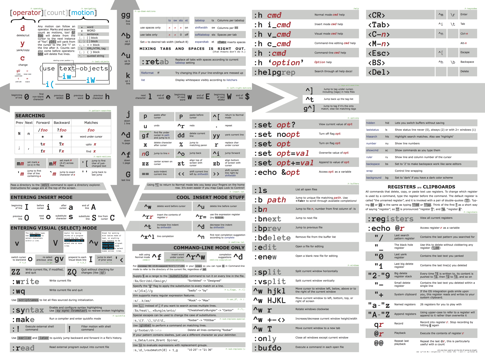
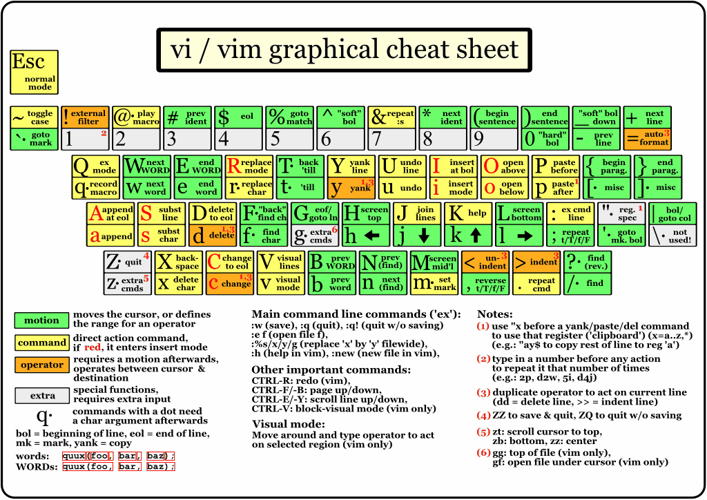
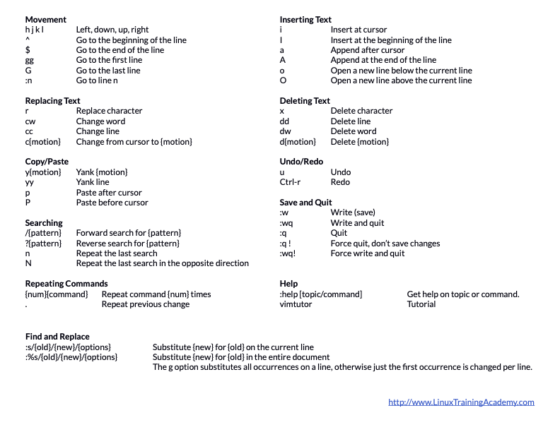

# Vim Exercises Repository

This repository contains a series of exercises and resources for learning and practicing Vim, the powerful text editor. Below are the links to the key resources available in this repository.

## Exercises

- [Exercise 01: Creating and Editing a New File with Vim](./Exercise-01-CreatingandEditingaNewFilewithVim.pdf)
- [Exercise 02: Essential Navigation Commands](./Exercise-02-EssentialNavigationCommands.pdf)
- [Exercise 03: Deleting Text](./Exercise-03-DeletingText.pdf)
- [Exercise 04: Getting Help](./Exercise-04-GettingHelp.pdf)
- [Exercise 05: Cut, Copy, Paste](./Exercise-05-CutCopyPaste.pdf)
- [Exercise 06: Inserting, Changing, Replacing, and Joining](./Exercise-06-InsertingChangingReplacingandJoining.pdf)
- [Exercise 07: Search, Find, Replace](./Exercise-07-SearchFindReplace.pdf)
- [Exercise 08: Text Objects](./Exercise-08-TextObjects.pdf)
- [Exercise 09: Macros](./Exercise-09-Macros.pdf)
- [Exercise 10: Visual Mode](./Exercise-10-VisualMode.pdf)
- [Exercise 11: Vimrc](./Exercise-11-Vimrc.pdf)
- [Exercise 12: Buffers](./Exercise-12-Buffers.pdf)

## Cheat Sheets

## Slides

- [Slides for Various Topics](./slides/)

## Sample Configuration

- [Sample Vim Configuration File](./vimrc-sample)

Feel free to explore and practice with the provided text files and exercises. Happy Vimming!
